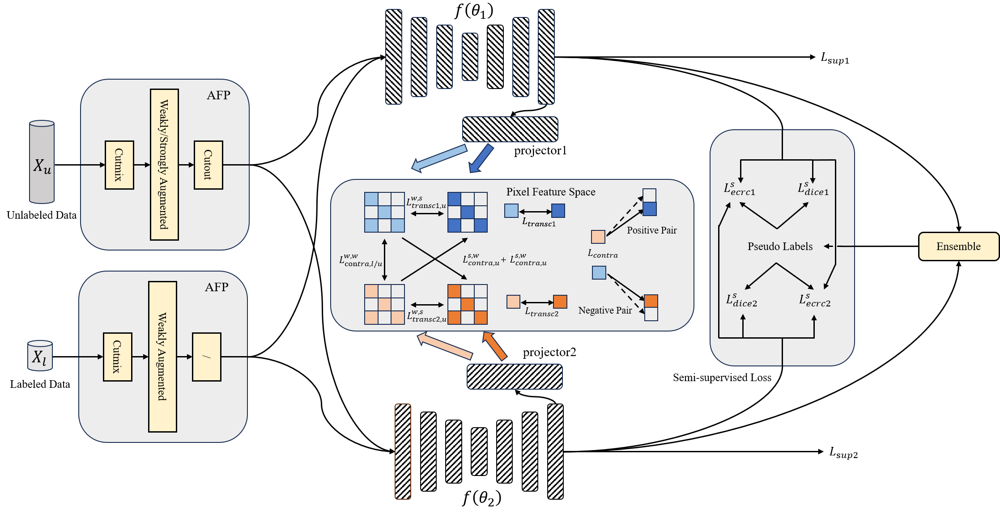

# APDC-PiCo
This repository contains the code for APDC-PiCo. Our manuscript "Improving Semi-supervised Biomedical Image Segmentation via Sampled Pixel-Level Contrastive Learning and Adaptive Perturbation with Dual-consistency Constraints" has been submitted to Knowledge-Based Systems. The original text and experimental results will be added to the repository as soon as the paper is accepted. Here, we have released the code for the convenience of the review process. 
 
